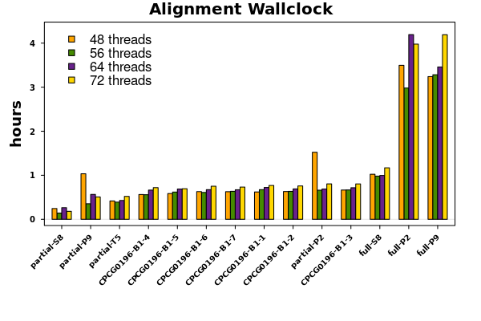
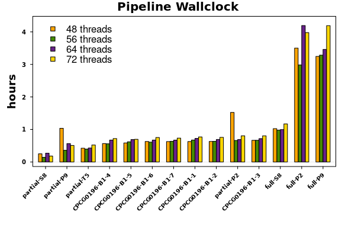
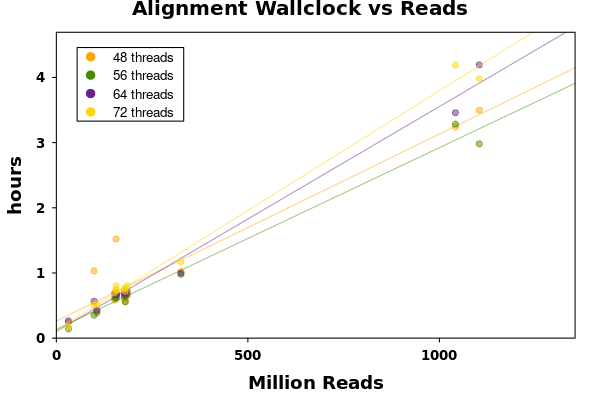
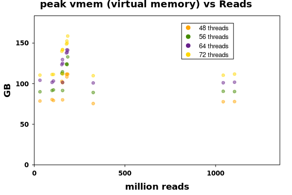
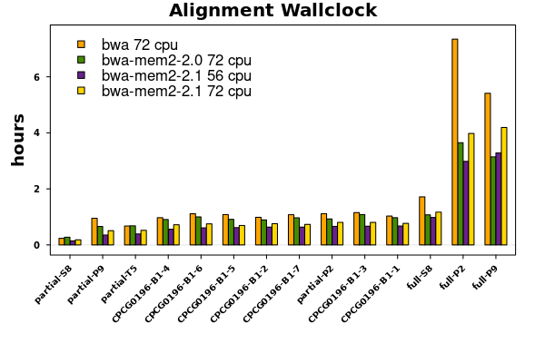
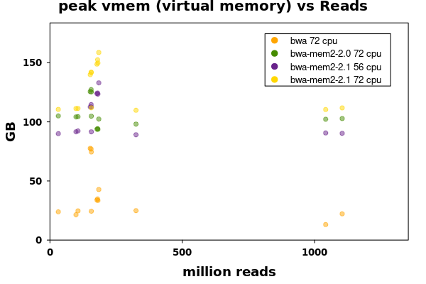

=========================
BWA-MEM2 2.1 Benchmarking
=========================

BWA-MEM2 version 2.1
--------------------

BWA-MEM2 is the next version of the bwa-mem algorithm in bwa, developed by the Parallel Computing Lab at Intel. BWA-MEM2 provides a significant improvement in alignment performance by reducing approximately half of the runtime. We previously tested the BWA-MEM2 version 2.0. It generates a very large genome index file which is above 60 GB using the human GRCh38 genome. It also uses about 4 times of the memory needed by the original BWA MEgit . During our testing, we found a out-of-memory error raised for several samples, which can be fixed by lowering number of threads. The BWA-MEM2 team released the version of 2.1 on 10/16/2020, in which they fixed the out-of-memory issue by redesigning their genome indexing strategy. Here we updated our align-DNA pipeline to the latest version of BWA-MEM2 (v2.1), and we performed some tests using our A-partial and A-full datasets. We compared the runtime and memory usage of the new BWA-MEM2 2.1 using various number of threads (48, 56, 64, and 72), and then compared the performance to its previous version (2.0) as well as the original BWA.

Performance using different threads
-----------------------------------

Figure 1 showed the alignment and pipeline wallclock using different number of threads. The alignment wallclock represents the time of execution of the alignment step done by BWA-MEM2, while the pipeline wallclock is the time used by the nextflow process. In this case, they are very similar. We did not find an obvious linear relationship between number of threads and BWA-MEM2 runtime. In fact, in several samples, using more threads actually increased the runtime (CPCG0196-B1 samples). There seems to be a U-shaped relationship in several samples (full-P2, full-S8, partial-P2 and partial-P9).

    **Fig. 1a:** Alignment wallclock barplot

    **Fig. 1a:** Pipeline wallclock barplot

Figure 2 showed the linear relationship between number of records in the FASTQ files against the corresponding runtime when using different number of threads. It is clear that the alignment time grows along with the number of records. 56 threads seems to provide the best overall alignment speed across all samples.

    **Fig. 2a:** Alignment wallclock time vs reads scatterplot

    **Fig. 2b:** Pipeline wallclock time vs reads scatterplot

Figure 3 showed the peak real memory and virtual memory used by BWA-MEM2 with different number of
threads. It's clear that more threads leads to a higher peak memory.

    **Fig. 3a:** Reads vs peak RSS scatterplot

    **Fig. 3b:** Reads vs peak vmem scatterplot

BWA-MEM2 2.1 vs 2.0 vs Original BWA
-----------------------------------

We then compared the alignment performence and peak memory usage of BWA-MEM2 2.1 vs BWA-MEM2 2.0 as well as the original BWA (Figure 4). The test results of the original BWA used 72 threads, so here we compared the BWA-MEM2 2.1 using both 56 and 72 threads, because using 56 threads provides the best performance according to above. To be noted that, for the BWA-MEM2 2.0, the CPCG1096-B1 samples only used 56 threads because of the out-of-memory issue. Again, BWA-MEM2 2.0 using 56 threads provided the best performance across all samples.

    **Fig. 4a:** Alignment wallclock time comparison between BWA, BWA-MEM2 2.0 and BWA-MEM2 2.1

    **Fig. 4b:** Pipeline wallclock time comparison between BWA, BWA-MEM2 2.0 and BWA-MEM2 2.1

The scatter plots of Figure 5 also support the idea that BWA-MEM2 2.1 with 56 threads performs the
best.

    **Fig. 5a:** Alignment wallclock time vs number of reads in BWA, BWA-MEM2 2.0 and BWA-MEM2 2.1

    **Fig. 5b:** Pipeline wallclock time vs number of reads in BWA, BWA-MEM2 2.0 and BWA-MEM2 2.1

Figure 6 showed that the peak memory needed by BWA-MEM2 2.1 was reduced for about 50% of that of
BWA-MEM2 2.0, although still about twice as much as the original BWA.

    **Fig. 6a:** Reads vs peak rss in BWA, BWA-MEM2 2.0 and BWA-MEM2 2.1

    **Fig. 6b:** Reads vs peak vmem in BWA, BWA-MEM2 2.0 and BWA-MEM2 2.1

We performed benchmarking tests on the new released BWA-MEM2 2.1, the previous version 2.0, as well
as the original BWA, using our A-partial and A-full datasets. The new version 2.1 is able to
significantly reduce the alignment time comparing to the original BWA, and also reduce the peak
memory usage. Additionally, using 56 threads is able to provide the best overall performance.
